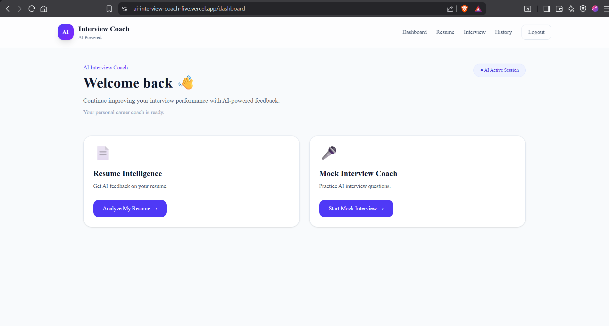
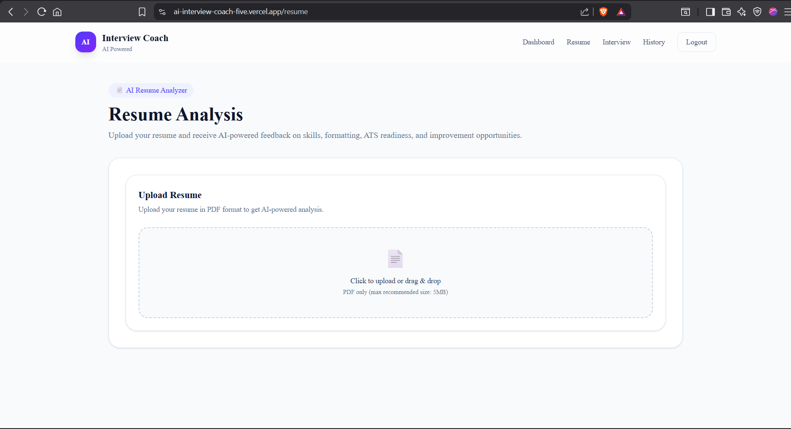
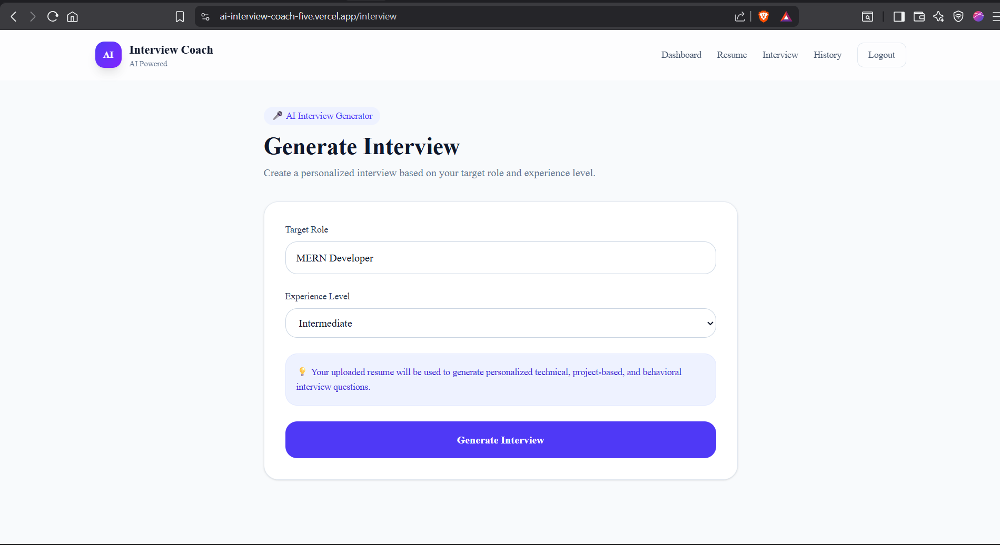
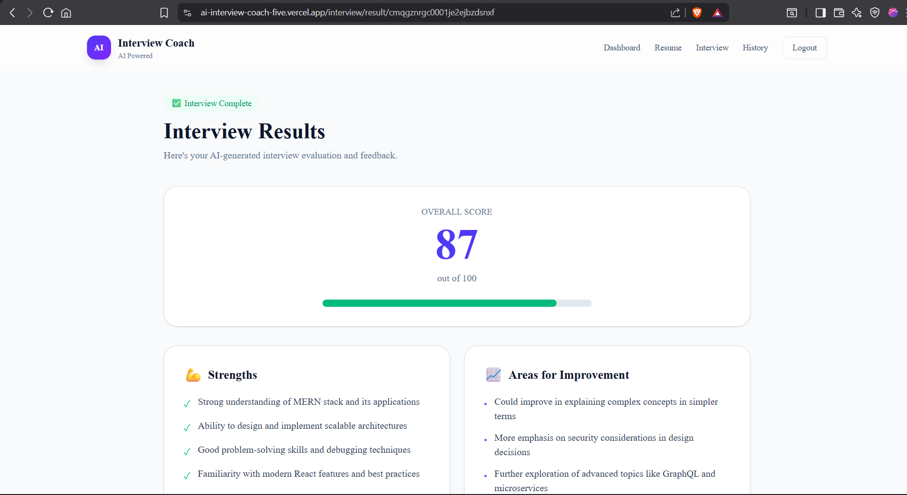

# 🎯 AI Interview Coach — AI-Powered Interview Preparation Platform

> 🚀 A full-stack AI interview preparation platform that helps candidates analyze resumes, practice realistic interviews, receive intelligent feedback, and track performance through personalized AI-driven evaluations.
>
> Built with a scalable microservice-inspired architecture using **Next.js, Express.js, FastAPI, Groq AI, PostgreSQL, and Prisma ORM**.

<p align="center">
  
  
  
  
  
</p>

<p align="center">
  <a href="https://ai-interview-coach-five.vercel.app">
    
  </a>
  <a href="https://ai-interview-coach-api-q2kl.onrender.com/">
    
  </a>
</p>

---

# ✨ Overview

AI Interview Coach is a modern interview preparation platform that simulates real-world interview experiences using artificial intelligence.

Users can upload resumes, receive detailed AI analysis, generate role-specific interview sessions, answer realistic technical and behavioral questions, and receive in-depth AI feedback with actionable improvements.

Whether you're preparing for software engineering interviews, data science roles, or general job opportunities, AI Interview Coach provides a personalized interview training experience.

---

# 🌟 Why AI Interview Coach Stands Out

* 🤖 AI-Powered Resume Analysis
* 📄 Resume Skill Gap Detection
* 🎯 Personalized Interview Generation
* 💼 Role-Specific Question Sets
* 🧠 Technical & Behavioral Evaluation
* 📊 AI Performance Scoring System
* 📈 Interview Progress Tracking
* 🔐 Secure Authentication & Protected Routes
* 🏗️ Scalable Multi-Service Architecture

---

# 🚀 Live Demo

<p align="center">
  <a href="https://ai-interview-coach-five.vercel.app">
    
  </a>
</p>

### Frontend

https://ai-interview-coach-five.vercel.app

### Backend API

https://ai-interview-coach-api-q2kl.onrender.com/

### AI Service

https://ai-interview-coach-fastapi.onrender.com/

---

# 📱 Product Preview

## 📊 Dashboard

<p align="center">
  
</p>

---

## 📄 Resume Analysis

<p align="center">
  
</p>

---

## 🎤 AI Interview Session

<p align="center">
  
</p>

---

## 📈 Interview Results

<p align="center">
  
</p>

---

# 🧠 System Architecture

```text
Next.js Frontend
        ↓
Express.js API Gateway
        ↓
FastAPI AI Service
        ↓
Groq LLM Processing
        ↓
PostgreSQL Database
        ↓
Prisma ORM
```

## 🏗️ Architectural Principles

* Separation of Concerns
* Independent AI Processing Layer
* Scalable Service-Oriented Design
* Secure Authentication Workflow
* Reusable API Architecture
* Database Abstraction via Prisma

---

# 🤖 AI Resume Analysis Engine

Users can upload resumes and receive comprehensive AI feedback.

### Capabilities

* PDF Resume Upload
* Resume Parsing & Extraction
* Resume Scoring (0–100)
* Skill Gap Identification
* Strengths & Weaknesses Detection
* Missing Technologies Suggestions
* Resume Improvement Recommendations
* Recommended Career Roles

---

# 🎤 AI Interview Generation

The platform dynamically generates interview sessions based on:

* Resume Content
* Experience Level
* Selected Job Role
* Technical Skills
* Project Experience

### Generated Question Types

* Technical Questions
* Behavioral Questions
* Problem Solving Questions
* Project-Based Questions
* Follow-Up Questions
* Role-Specific Assessments

---

# 📊 AI Interview Evaluation

After completing an interview session, users receive:

* Overall Performance Score
* Technical Accuracy Assessment
* Communication Evaluation
* Confidence & Clarity Analysis
* Strength Identification
* Improvement Suggestions
* Per-Question Feedback

---

# 🔐 Authentication & Security

* Secure Signup & Login
* JWT Authentication
* Protected API Routes
* Persistent User Sessions
* Secure Password Handling

---

# 🏗️ Tech Stack

## Frontend

* Next.js 16
* TypeScript
* Tailwind CSS
* Axios
* Context API

## Backend

* Node.js
* Express.js
* Prisma ORM
* PostgreSQL
* JWT Authentication

## AI Service

* FastAPI
* Python
* Groq API
* Prompt Engineering

## Database

* PostgreSQL
* Prisma ORM

---

# 📂 Project Structure

```text
ai-interview-coach/
│
├── client/
├── server/
│       └──prisma/
├── ai-service/
└── README.md
```

---

# 🚀 Deployment Architecture

| Layer       | Platform   |
| ----------- | ---------- |
| Frontend    | Vercel     |
| Backend API | Render     |
| AI Service  | Render     |
| Database    | PostgreSQL |
| ORM         | Prisma     |

---

# ⚙️ Local Development Setup

## Clone Repository

```bash
git clone https://github.com/hadishah123/ai-interview-coach.git

cd ai-interview-coach
```

---

## Frontend Setup

```bash
cd client

npm install

npm run dev
```

---

## Backend Setup

```bash
cd server

npm install

npm run dev
```

---

## AI Service Setup

```bash
cd ai-service

python -m venv venv

# Windows
venv\Scripts\activate

pip install -r requirements.txt

uvicorn main:app --reload --port 8000
```

---

# 🔑 Environment Variables

## Backend

```env
PORT=
DATABASE_URL=
JWT_SECRET=
FASTAPI_URL=
```

## AI Service

```env
GROQ_API_KEY=
```

---

# 🛣️ Roadmap

* 🎙️ Voice-Based Interviews
* 📚 Interview History
* 📈 Dashboard Analytics
* 🤖 AI Follow-Up Questions
* 📄 Resume Version Tracking
* 📤 Export Interview Reports
* 👨‍💼 Admin Dashboard
* 🌍 Multi-Language Support

---

# 🎯 Ideal For Demonstrating

* Full-Stack Development
* AI Application Development
* Prompt Engineering
* Resume Parsing Systems
* LLM Integration
* Microservice Architecture
* PostgreSQL Database Design
* Authentication Systems
* API Design & Deployment

---

# 🤝 Contributing

Contributions, ideas, and improvements are always welcome.

1. Fork the repository
2. Create a feature branch
3. Commit your changes
4. Push your branch
5. Open a Pull Request

---

# 👨‍💻 Author

## Abdul Hadi

Full Stack Developer | AI-Powered Web Applications

GitHub:
https://github.com/hadishah123

Portfolio:
https://hadishah.vercel.app

---

# ⭐ Support the Project

If you found this project useful:

* ⭐ Star the repository
* 🍴 Fork the project
* 🐛 Report issues
* 💡 Suggest features
* 🤝 Contribute improvements

<p align="center">
  <b>Built with AI, code, and a passion for helping candidates succeed 🚀</b>
</p>
